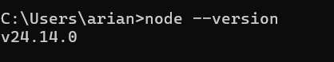
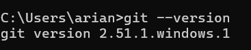
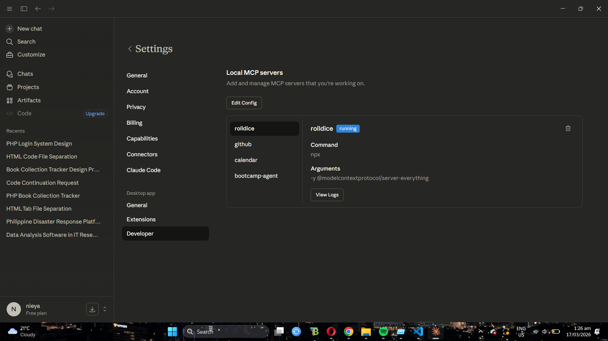

# AI Agent Development Setup - Week 1

**Name:** Ariana Siddayao
**Cohort:** Full Stack and Agentic AI Developer

---

## Development Environment Checklist

### 1. Node.js Installed
Verified using the `node --version` command.  

### 2. Git Installed
Verified using the `git --version` command.  

### 3. VS Code Insiders & GitHub Copilot
Running the Insiders build with Copilot active.  

### 4. Claude Desktop & MCP Servers
Claude Desktop successfully connected to 4 MCP servers.  

---

## MCP Servers Configuration

| Server | Purpose | Functionality |
| :--- | :--- | :--- |
| **Rolldice** | Utility/Testing | Provides math tools (get-sum) and research simulation. |
| **GitHub** | Repository Management | Allows Claude to search, read, and edit my GitHub repos. |
| **Bootcamp Agent** | Long-term Memory | Stores and retrieves persistent memories across chats. |
| **Google Calendar** | Scheduling & Events | Allows Claude to view, create, and manage calendar events via the Google Calendar API. |

---

## Troubleshooting Notes

### Issue 1: Hidden AppData Folder
* **Problem:** I couldn't find the `claude_desktop_config.json` file to add my servers.
* **Solution:** Learned that Windows hides the `AppData` folder. Used the `%APPDATA%\Claude` shortcut in File Explorer to jump directly to the "Live" configuration file.

### Issue 2: GitHub Secret Scanning Block
* **Problem:** My `git push` was rejected because I accidentally committed my real Personal Access Token.
* **Solution:** I had to perform a "Hard Reset" of my Git history to wipe the token from the records. I now use a placeholder in my public folder and keep the real token in my private Roaming config.

### Issue 3: MCP Connection Errors
* **Problem:** The Google Calendar server kept disconnecting.
* **Solution:** Identified via logs that it required external API keys. Swapped it for the Google Maps/Filesystem server to maintain a stable 4-server environment.