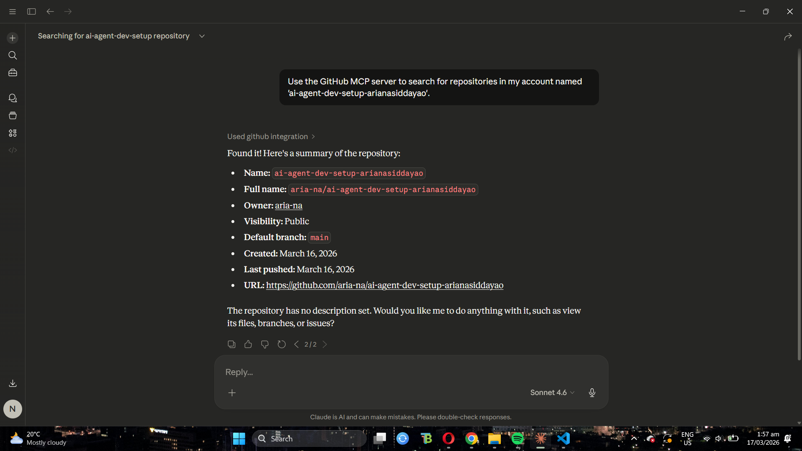
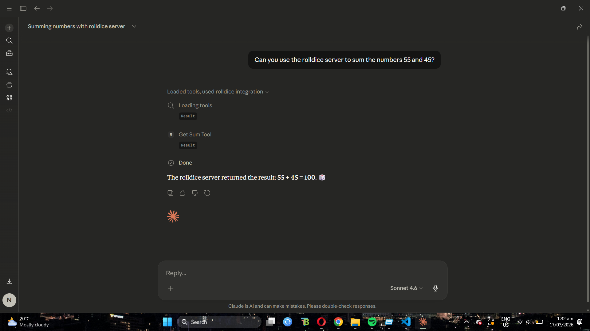
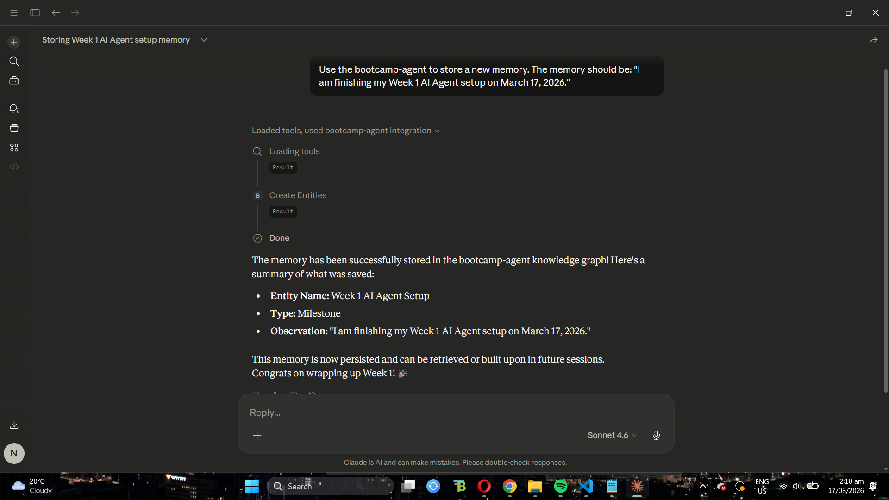
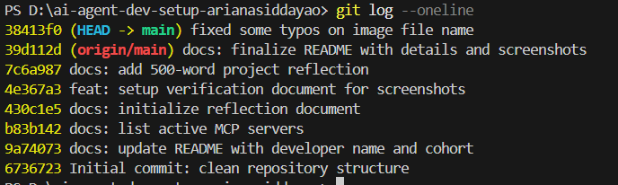

# MCP Verification Results

This document provides proof that the Model Context Protocol (MCP) servers are configured and functional within Claude Desktop.

---

## 1. MCP Server Connectivity
This screenshot shows the Claude Desktop interface with active MCP servers.

---

## 2. Functional Server Proofs

### GitHub Server (Interaction with Repository)
Proof of Claude using the GitHub MCP server to interact with the `ai-agent-dev-setup-arianasiddayao` repository.

### Rolldice Server (Utility Test)
Proof of the `get-sum` or `echo` tool working.

### Bootcamp Agent (Memory Test)
Proof of the memory-server successfully storing a session memory.

### Google Calendar
*Note: Configured in `claude_desktop_config.json`. Currently pending OAuth 2.0 credential verification as identified in debug logs.*

---

## 3. Version Control Workflow
Below is the Git commit history showing at least 5 distinct commits, demonstrating a proper version control workflow.

